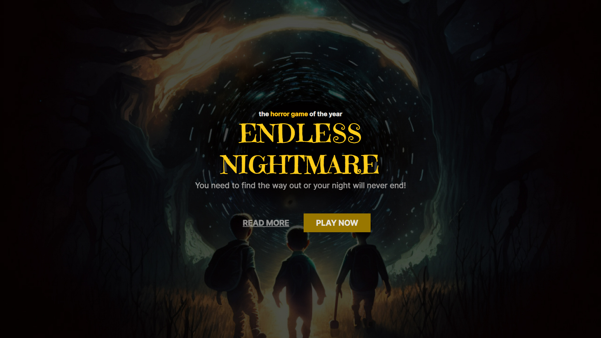

<h1 align="center"> Landing page - Endless Nightmare </h1>

Evento exclusivo e gratuito, promovido pela Rocketseat para ensino de tecnologias WEB.

  <a href="#-tecnologias">Tecnologias</a>&nbsp;&nbsp;&nbsp;|&nbsp;&nbsp;&nbsp;
  <a href="#-projeto">Projeto</a>&nbsp;&nbsp;&nbsp;|&nbsp;&nbsp;&nbsp;
  <a href="#-layout">Layout</a>&nbsp;&nbsp;&nbsp;

 

  

## 🚀 Tecnologias

Esse projeto foi desenvolvido com as seguintes tecnologias:

- HTML e CSS
- Git e GitHub

## 💻 Projeto

O projeto foi o desenvolvimento de uma landing page de um game de terror

## 🔖 Layout

Você pode visualizar o layout do projeto através [DESSE LINK](https://www.figma.com/file/bHm7b4N8L2FiA9W9rrFDKa/Horror-Game-LP-(Community)?t=e5lQPfBXP8paxLkH-0). É necessário ter conta no [Figma](https://figma.com) para acessá-lo.

---